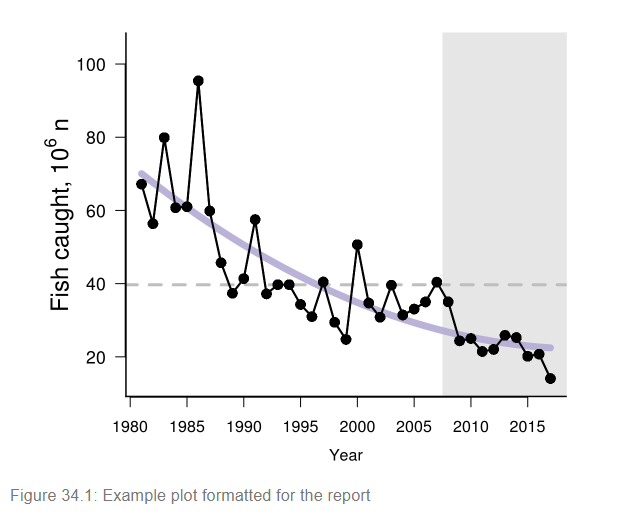

```{r setup, include=FALSE}
options(htmltools.dir.version = FALSE)
knitr::opts_chunk$set(echo = F,
                      warning = F,
                      message = F)
#Plotting and data libraries
library(knitr)

```


## Overall SOE structure

```{r slide2, echo = F, out.width = "100%", fig.align = "center"}

```

---


## Visualization schemes
```{r pos, echo = F, out.width = "70%", fig.align = "center"}

```


```{r neg, echo = F, out.width = "40%", fig.align = "center"}

```
.footnote[
https://github.com/NOAA-EDAB/ecodata
]
---

## Supporting Materials 

```{r tech-doc, echo = F, out.width = "100%", fig.align = "center"}
knitr::include_graphics("images/tech-doc1.png")
```
.footnote[
https://noaa-edab.github.io/tech-doc.html
]

